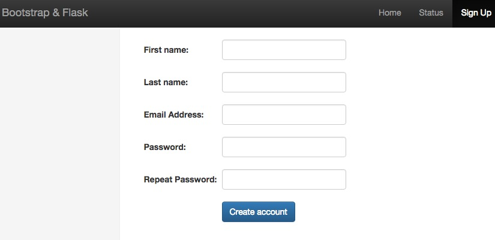
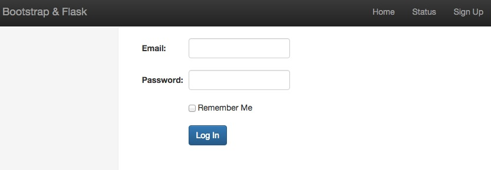
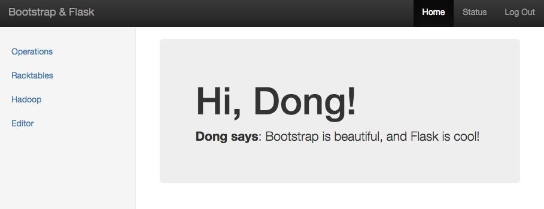
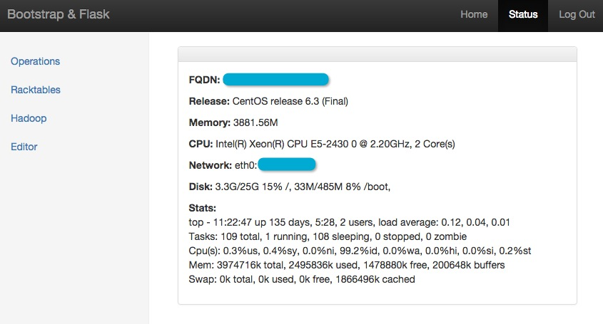
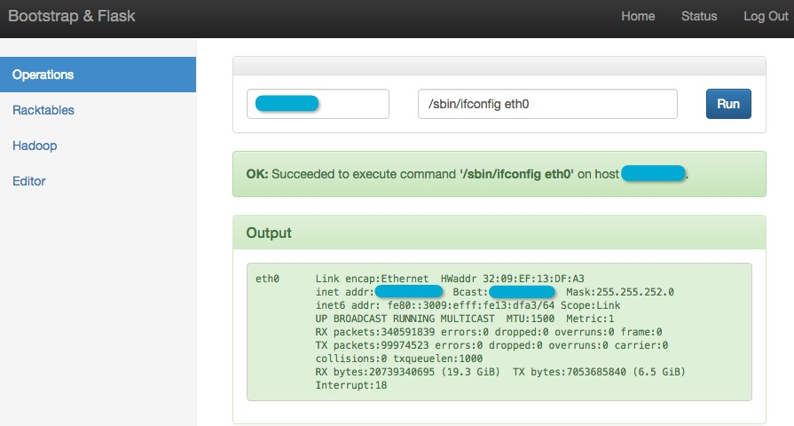
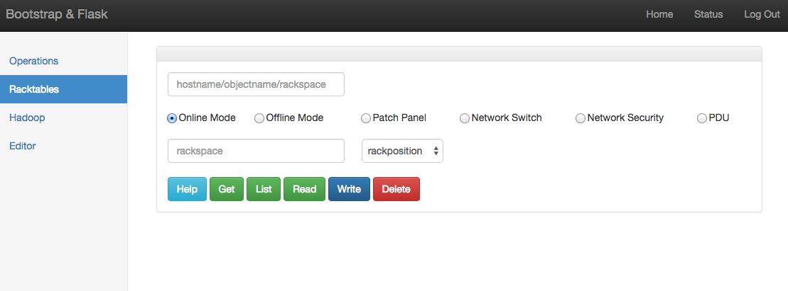
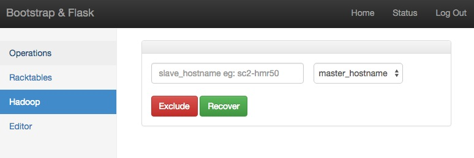
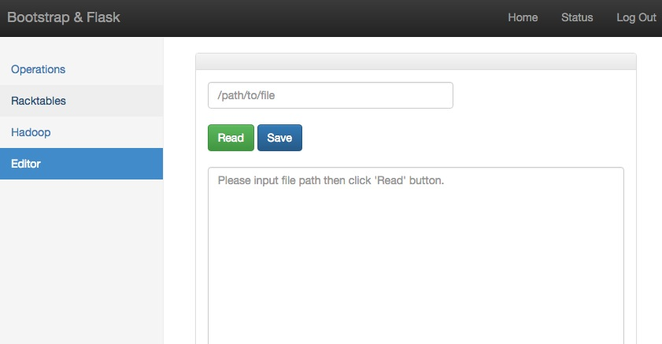

Instruction
---
1. Clone the repo 
`cd ~` 
`git clone https://github.com/mcsrainbow/devopsdemo` 

2. Configure the environment 
`cd devopsdemo/scripts` 
`./requirements.sh all` 

3. Run the app 
`cd ~/devopsdemo` 
`. flask/bin/activate` 
`./run.py` 

Screenshots
---
 
 
 
 
 
 
 
 
